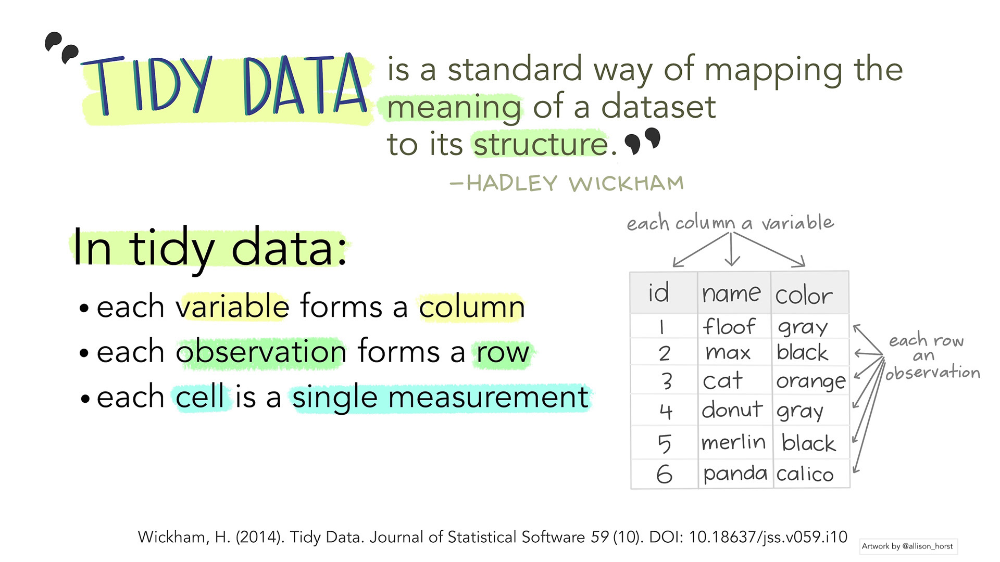
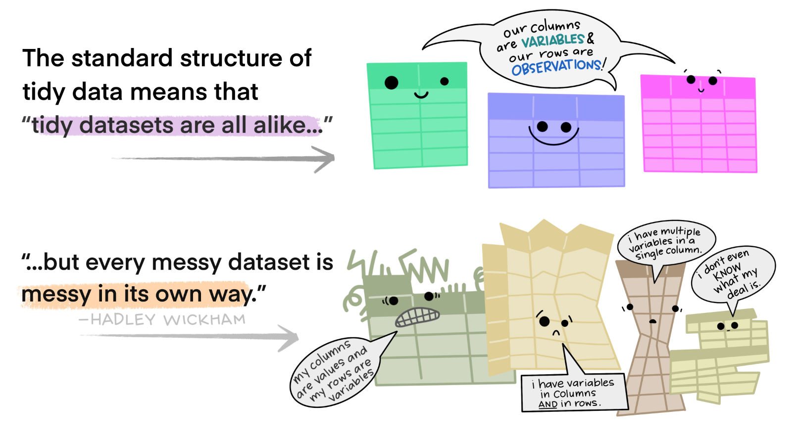
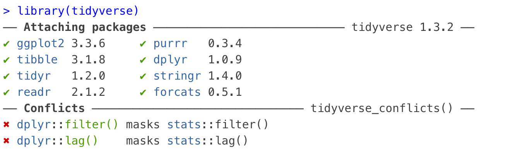
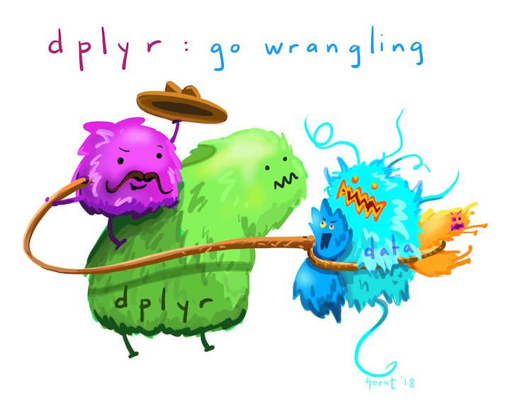

```{r setup, include=FALSE}
# packages
library(learnr)
library(tidyverse)
library(modeest)
library(DescTools)
# hide non-exercise code chunks
knitr::opts_chunk$set(echo = FALSE)
# import StudentsPerformance.csv
std_perf <- read.csv("StudentsPerformance.csv")
std_perf_exam <- read_csv("StudentsPerformance.csv")
```

## Welcome

This is DiscovRStat, the R laboratory materials for the course STAT2100: Discovering Statistics using R. The course is offered by the <a href="https://www.squ.edu.om/science/Departments/Statistics" target="_blank">department of Statistics</a> at <a href="https://www.squ.edu.om" target="_blank">Sultan Qaboos university</a>. R is a popular choice in data analytics for statistical computing and graphics that is widely used in sciences and social sciences. DiscovRStat introduces the R software environment, descriptive statistics, graphical exploration of data and basic inferential statistic such as analysis of relationships among variables using correlation and regression basic concepts.

If this is the first time you hear about R, the following short video created by R Consortium provides an overview about the program, its applications and what is used for.

<center>

<iframe width="560" height="315" src="https://www.youtube.com/embed/XcBLEVknqvY" title="YouTube video player" frameborder="0" allow="accelerometer; autoplay; clipboard-write; encrypted-media; gyroscope; picture-in-picture" allowfullscreen>

</iframe>

</center>

## Install RStudio

In RStat2101, you are going to work with a user-friendly R interface called RStudio. It is an integrated development environment (IDE) for working with R. It is easy for writing scripts and has practical features for data analysis and visualizations. Check out Rstudio website to take a tour of <a href="https://www.rstudio.com/products/RStudio/" target="_blank">RStudio's IDE</a>.

To install RStudio Desktop version on your personal computer, you need to install R first and then Rstudio.

-   To download and install R, click <a href="https://cran.r-project.org/" target="_blank">here</a>
-   To download and install RStudio, click <a href="https://www.rstudio.com/products/rstudio/download/" target="_blank">here</a>

{style="float: right; width: 200px; height: 200px;  "} For help installing R and RStudio, follow the installation instructions for <a href="https://rpubs.com/ImanAlhasani/RInstallationforWindows" target="_blank">Windows</a> users and <a href="https://rpubs.com/ImanAlhasani/RInstallationforMac" target="_blank">Mac</a> users (courtesy of Afra Al Manei, Department of Statistics, SQU). You can also sign up in <a href="https://rstudio.cloud/" target="_blank">RStudio Cloud</a> and use the online version of the program. Also, RStudio is available in Anaconda Navigator. However, R packages are not included in the default base environment and hence an R environment has to be created to run Rstudio. For help, see this <a href="https://docs.anaconda.com/anaconda/navigator/tutorials/create-r-environment/" target="_blank">Anaconda Documentation</a>.

## Discover R: Basics

#### Get Started

To use RStudio, you type code in it and ask the device to interpret them and act on their instructions. For some of you, this could be the first time you are coding, but do not worry! The course does not require to have any background in computer programming! Here, we will walk you through each of the steps required to begin using Rstudio.

Let us start your first R code! The following box is an empty code chunk provided to write and run code. For example, write `print("Welcome to R!")` and then click `Run Code`. The output will be shown below the chunk.

```{r welcome, exercise=TRUE}
```

Congrats, you've run your first line of code!{style="float: right;    " width="179" height="81"}

#### Create a Project

Rstudio project helps data analysts to group and organize all files required to conduct a project. This includes data files, analysis scripts, graphs and the analysis reports. The project is associated with R working directories. In this course, we focus on creating a project in a brand new directory. To create a project in R:

1.  click `File` - `New project..`, and then create project from `New Directory`.
2.  choose `New Project`
3.  name your project in `Directory name`.
4.  click `Browse…` to create a path to working directory and keep your project in.
5.  click `Create Project`.

This will open a new RStudio session with a title of your project name. In the file pane, the path of the selected working directory will appear and the created project is shown with an `.Rproj` extension.

##### Exercise:

> Create a project with a name `DiscovRStat` and make it a sub-directory of a folder named `Stat2100` on your desktop. [Hint: Follow the steps listed above.]

#### Create R Scripts

R code can be written and executed on the Console Pane. However, when a one is working on a project, the code gets long quickly with different instructions. Thus, it is more convenient to script code by creating an R script. To create an `R Script`, click `File` -- `New File` -- `R Script`. To save the R script, click `File` - `Save`, or click the `Save icon` at the top of the Script Editor panel. Make sure to save it in your working directory to organize your project files. This will show a file in the file pane with an `.R` extension.

##### Exercise:

> In your `DiscovRStat` project, create an R Script and save it with a name `my_first_rscript`. Type the following on `my_first_rscript.R` and run each line by clicking `Run`.
>
> -   `"Welcome to my first R script"`
> -   `'Welcome to my first R script'`
> -   `print("Welcome to my first R script")`
> -   `paste("Welcome to my first R script")`
>
> Is there any difference in the outputs given by the four commands?

```{r welcome-script, exercise=TRUE, exercise.eval=TRUE}
#try to type the four commands here!

```

```{r welcome-script-hint }

"Welcome to my first R script" 

'Welcome to my first R script' 

print("Welcome to my first R script") 

paste("Welcome to my first R script")

```

#### Create Objects

In order to record a value in memory, we store the value in an object using the assignment operator `<-`; `object <- value`. The value can be a single value, set of values in a vector, table, matrix, list, function, etc. It can take numerical or non-numerical values.

##### Exercise:

> Assign 2 to $x$ and 5 to $y$, then find $x^y$ and store the result in $z$.

```{r assignvalue1, exercise=TRUE, exercise.eval=TRUE}

```

```{r assignvalue1-hint}
#assign 2 to x and 5 to y
x <- 2
y <- 5

#find $x^y$ and store the result in $z$
z <- x^y     ##try z <- x**y
z  ## print the result
```

##### Exercise:

> 1.  Assign Stat2100 to an object `course_code`.
> 2.  Assign 2 to an object `course_credit`.
> 3.  Assign FALSE to an object `prerequisite`.
> 4.  Print the values.
> 5.  Print the following statement: Stat2100 is a university elective course of 2 credits.
> 6.  Print the previous statement using objects: `course_code` and `course_credit`.

```{r assignvalue2, exercise=TRUE, exercise.eval=TRUE}

```

```{r assignvalue2-hint}
#assign Stat2100 to university_course
course_code <- "Stat2100"  ## type non-numerical value within " "
#assign 2 to  course_credit.
course_credit <- 2          
#assign FALSE to an object prerequisite.
prerequisite <- FALSE

#print course_code, course_credit and prerequisite
course_code          ## try print(course_code)
course_credit        ## try print(course_credit)
prerequisite         ## try print(prerequisite)

#print Stat2100 is a university elective course of 2 credits.
print("Stat2100 is a univeristy elective course of 2 credits.") 
##try to use paste() instead of print() in the previous line.

#print the previous statement using objects: course_code and course_credit.
# use paste() to concatenate inputs into a single string.
paste(course_code, "is a univeristy elective course of", course_credit, "credits.") 
##try paste0() instead of paste() and notice the difference
```

To combine a collection of values in a vector, use the concatenate function `c()`.

##### Exercise:

> 1.  Assign Stat2100, Stat2101 and Stat2102 to an object `stat_courses`.
> 2.  Assign 2, 4 and 3 to an object `credits`.
> 3.  Assign FALSE, FALSE and TRUE to an object `require_prerequisite`.
> 4.  Print the values.

```{r assignvector, exercise=TRUE, exercise.eval=TRUE}

```

```{r assignvector-hint}
#assign Stat2100, Stat2101 and Stat2102 to stat_courses.
stat_courses <- c("Stat2100", "Stat2101", "Stat2102") 
#assign 2, 4 and 3 to credits.
credits <- c(2, 4, 3)   
#assign FALSE, FALSE and TRUE to require_prerequisite.
require_prerequisite <- c(FALSE, FALSE, TRUE)
#print stat_courses, credits and require_prerequisite.
stat_courses     
credits  
require_prerequisite

```

To retrieve values from a vector, type the name of the vector followed by square brackets. In the square brackets, place the index of the value. For example, check the output of the following: `stat_courses[2]` , `stat_courses[2:3]` and `stat_courses[c(1,3)]`.

```{r assignvector-index, exercise=TRUE, exercise.eval=FALSE}
stat_courses <- c("Stat2100", "Stat2101", "Stat2102")
# check the output.
# you can write more than one commands in one line with ; separator
stat_courses[2]; stat_courses[2:3]; stat_courses[c(1,3)] 
```

```{r assignvector-index-hint}
#extract the second element
stat_courses[2]
#extract the second and third elements
stat_courses[2:3]
#extract the first and third elements
stat_courses[c(1,3)] 
```

Use `str()` to display the structure of a vector. It returns the length of the vector and its data type, followed by its values or by some of the initial values if the length is large. Additionally, you can use `length()` to get the length of a vector, and you can use `mode()`, `class()` or `typeof()` to check the type of data.

##### Exercise:

> 1.  Display the structure of `stat_courses`, `credits` and `require_prerequisite` using `str()` function.
> 2.  Check the length of `stat_courses`, `credits` and `require_prerequisite` using `length()` function.
> 3.  Check the data type of `stat_courses`, `credits` and `require_prerequisite` using `mode()` function.

```{r vector-str, exercise=TRUE, exercise.eval=TRUE}

```

```{r vector-str-hint}
stat_courses <- c("Stat2100", "Stat2101", "Stat2102") 
credits <- c(2, 4, 3)    
require_prerequisite <- c(FALSE, FALSE, TRUE)
#display the structure of stat_courses, credits and require_prerequisite
str(stat_courses)
str(credits)
str(require_prerequisite)
#check the length of stat_courses, credits and require_prerequisite
length(stat_courses)
length(credits)
length(require_prerequisite)
#check the data type of stat_courses, credits and require_prerequisite
#try to use class() or typeof() instead of mode()
mode(stat_courses) 
mode(credits)     
mode(require_prerequisite)   
```

## Discover R: Packages

<center>

<iframe src="https://drive.google.com/file/d/15qo2L-Ihddn8Tr6Hi7nD3vfnZs6ouHfZ/preview" width="900" height="500" allow="autoplay">

</iframe>

</center>

## Discover Data: Basics

#### 1. Load built-in datasets

R comes with built-in datasets, some datasets are included in base packages, like `datasets` package while others require package installation. To list the datasets available in a package, use data(package = "Package Name"). For example list the datasets available in the package `datasets`:

```{r list-data, exercise=TRUE, exercise.eval=TRUE}
#list the datasets available in the package datasets 
data(package = "datasets")
```

```{r list-data-hint}
#or simply use data(); datasets is a base package! 
```

To know more about the R Datasets Package, use `packageDescription("datasets")` or `help("datasets")` . To load a dataset in the R environment, use `data("Dataset Name")` or `data(Dataset Name)`. For example, to load `mtcars` dataset from the available data, type `data("mtcars")` or `data(mtcars)`. To see the to see the dataset description run `?mtcars`.

```{r load-mtcars, echo=TRUE}
data("mtcars")
```

To get specific information about the data file such as

-   structure of the dataset, use `str()`
-   number of columns, use `ncol()`
-   number of rows, use `nrow()`
-   number of rows and number of columns, use `dim()`
-   names of variables use `names()` or `colnames()`

##### Exercise:

> 1.  Explore the structure of `mtcars` dataset using `str()` function.
> 2.  Get the name of the variables of `mtcars` dataset using `names()` function.
> 3.  Get the dimension of `mtcars` dataset using `dim()` function

```{r str-mtcars, exercise=TRUE, exercise.eval=TRUE}
#load mtcars dataset in the R envirnoment
data(mtcars) 
```

```{r str-mtcars-hint}
#1. display the structure of mtcars
str(mtcars)
#2. get the name of the variables (column names)
names(mtcars)
#3. get the dimension (# of rows x # of columns) of mtcars
dim(mtcars)
```

To display the first six rows of the dataset, use `head()` function.

```{r head-mtcars, exercise=TRUE, exercise.eval=TRUE}
#display the first six rows of the mtcars dataset
head(mtcars)
```

To display the last six rows of the dataset, use `tail()` function.

```{r tail-mtcars, exercise=TRUE, exercise.eval=TRUE}
#display the first six rows of the mtcars dataset
tail(mtcars)
```

To refer to a variable in the dataset, write the name of the data followed by `$` and the name of the variable. For example, to extract `mpg` variable, type `mtcars$mpg`.

```{r subset1-mtcars, exercise=TRUE, exercise.eval=TRUE}
# extract mpg variable from the mtcars dataset
mtcars$mpg
```

To retrieve values from a specific variable, type the name of the data followed by square brackets. For example to extract the first value in `mpg` variable, type `mtcars$mpg[1]` and to extract the first 10 values in `mpg`, type `mtcars$mpg[1:10]`.

```{r subset2-mtcars, exercise=TRUE, exercise.eval=TRUE}
#extract the first value in mpg variable
mtcars$mpg[1]
#extract the first 10 values in mpg variable
mtcars$mpg[1:10]
```

In addtion, to reteieve values from a dataset, type the name of the data followed by square brackets. In the square brackets, place its row index and its column index separated by a comma. For example, to retrieve a data value in row 10 and column 8 from `mtcars`, use `mtcars[10,8]`. Explore the output of `mtcars[,2]`, `mtcars[1,]`, `mtcars[1:2,1]` and `mtcars[c(1,3),]`.

```{r subset3-mtcars, exercise=TRUE, exercise.eval=TRUE}
#extract a value in row 10 and column 8 from mtcars
mtcars[10,8]
```

```{r subset3-mtcars-hint}
mtcars[,2]  #returns the values in the second variable
mtcars[1,]  #returns the values in the first row
mtcars[1:2,1] #returns the values in the first two rows of the first variable
mtcars[c(1,3),]# returns the values in the first and third rows
```

Subsets of a dataset can be extracted based on logical evaluation or comparison using logical operators. Here are some of the most common logical operators:

| less than | less than or equal | greater than | greater than or equal | exactly equal | not equal | and | or  |
|---------|---------|---------|---------|---------|---------|---------|---------|
| \<        | \<=                | \>           | \>=                   | ==            | !=        | &   | \|  |

##### Exercise:

> 1.  Get a subset of mtcars such that mpg values are less than or equal to 20.

```{r subset4-mtcars, exercise=TRUE, exercise.eval=TRUE}
# examine each value in mpg whether is <=20 or not
mtcars$mpg<=20
#get a subset of mtcars such that mpg values<= 20
mtcars[mtcars$mpg<=20, ]
```

#### 2. Read .csv Data File

Consider a csv data file of <a href="https://www.kaggle.com/datasets/spscientist/students-performance-in-exams" target="_blank">Students Performance in Exams</a> on <a href="https://www.kaggle.com/datasets" target="_blank">Kaggle datasets</a> . To read the .csv data file, use the R bases function `read.csv()`. To avoid printing all data values, it is recommended to assign a name to the data file to call it for further uses.

```{r readcsv-data, echo=TRUE}
## read StudentsPerformance.csv 
## assign the data file to an objectstd_perf
std_perf <- read.csv("StudentsPerformance.csv")
# display the first six rows of Students Performance dataset
head(std_perf)
```

##### Exercise:

> 1.  Display the structure of std_perf
> 2.  Get the name of std_perf variables
> 3.  Display the head of a subset of std_perf for male students and got above 90 in maths.

```{r subset1-stdperf, exercise=TRUE, exercise.eval=TRUE}

```

```{r subset1-stdperf-hint}
#display the structure of std_perf
str(std_perf)
#get the variable names of std_perf
names(std_perf)
#get a subset of std_perf for male students and got above 90 in maths.
head(std_perf[std_perf$gender=="male" & std_perf$math_score>90, ])
```

#### 3. Create Data Frame

A data frame is a collection of vectors organized in rows and columns. Each column represents a variable (vector) and each row represents an observation (values). To create a data frame use `data.frame()`. For example, create a small data frame called `statcourses_info` that takes the vectors created in Discover R Basics: `stat_courses`, `credits` and `require_prerequisite`.

```{r dataframe, exercise=TRUE, exercise.eval=TRUE}
# vectors
stat_courses <- c("Stat2100", "Stat2101", "Stat2102")
credits <- c(2, 4, 3)
require_prerequisite <- c(FALSE, FALSE, TRUE)
# dataframe
statcourses_info <- data.frame(stat_courses, credits, require_prerequisite)
statcourses_info # print statcourses_info 
```

```{r dataframe-hint, exercise=TRUE, exercise.eval=TRUE}
# dataframe: you can build the vector inside the dataframe
statcourses_info <- data.frame(
  stat_courses=c("Stat2100", "Stat2101", "Stat2102"),
  credits = c(2, 4, 3),
  require_prerequisite = c(FALSE, FALSE, TRUE))

statcourses_info # print statcourses_info 
```

##### Exercise:

> 1.  Display the structure of statcourses_info
> 2.  Get the name of statcourses_info variables
> 3.  Get the dimension of statcourses_info

```{r statcourses_info, exercise=TRUE, exercise.eval=TRUE}
statcourses_info <- data.frame(
  stat_courses=c("Stat2100", "Stat2101", "Stat2102"),
  credits = c(2, 4, 3),
  require_prerequisite = c(FALSE, FALSE, TRUE))


```

```{r statcourses_info-hint}
#display the structure of std_perf
str(statcourses_info)
#get the variable names of std_perf
names(statcourses_info)
#getthe dimension of statcourses_info
dim(statcourses_info)
```

#### Practice Quiz:

```{r quiz-q1, echo=FALSE}
  question("What is the correct syntax to display the first six rows of a dataset df?",
  answer("head(df)"),
  answer("head(df,6)"),
  answer("df[1:6,]"),
  answer("All options are correct",  correct = TRUE),
  allow_retry = TRUE
)
```

```{r quiz-q2, echo=FALSE}
  question("Which of the R functions listed below are used to display the dimension of the dataset, the included variables and data types in one output?",
    answer("str()", correct = TRUE),
    answer("names()"),
    answer("typeof()"),
    answer("colnames()"),
    allow_retry = TRUE
  )
```

## Discover Data: Tidy

In practice data sets come in various forms, structures or shapes. To gain benefits and values from data, it is recommended to organize it in a tabular or rectangular form where

-   each column represents a variable
-   each row represents an observation
-   each cell represents a value

Data following this rectangular structure is known as **TIDY DATA**.

[{style="width: 800px; height: 350px;  "}](https://www.openscapes.org/blog/2020/10/12/tidy-data/)

Tidy data is considered as the standard structure of datasets. Therefore, tidy data allows you to use the same analysis tools such as cleaning and processing tools, visualization tools and modeling tools for different datasets. Tidy data also makes the analyses shareable and reproduicable; where it can be updated and reused by others.

In contrast, untidy data differs in its shape and structure, and hence different wrangling tools are required for each dataset to convert it into a tidy form. Working with untidy data restricts the efficiency of the analysis and makes it hard to be reused or reproduced.

{style="width: 800px; height: 350px;  "}

{style="float: right;    " width="200" height="180"} R provides provides operative tools for reshaping data structure into tidy form. It also provides other helper tools for data analysis including: data manipulation, data visualization and data modeling. These tools belong to different packages in R but some are connected to a one package called <a href="https://www.tidyverse.org/packages/" target="_blank">`tidyverse`</a>. In this course, we introduce the basics of data wrangling and manipulation using some `dplyr` verbs and data visualization using `ggplot2`.

To install tidyverse package, type in the R console:

``` {.R style="background-color: white"}
install.packages("tidyverse")
```

To load the package in the R environment, type in the rmarkdown file, R script or R console :

``` {.R style="background-color: white"}
library(tidyverse)
```

This gives the packages included in tidyverse package as illustrated below. At this level, you can ignore the conflicts section. {style="width: 800px; height: 200px;  "}

## Discover Data: Pipes

{style="float: right;  " width="400" height="300"} The common step to explore a tidy dataset is to focus on certain variables of interest or on subsets of the data. This requires to transform or arrange the data in a form that is easy to understand and interpret. This process is called data wrangling and manipulation. In this section, you will learn the most common wrangling tasks using the `tidyverse` package `dplyr` and pipes `%>%`. The pipes are used to perform sequence of tasks in a readable code format.

To learn about data wrangling and manipulation with `dplyr`, consider a dataset of <a href="https://www.kaggle.com/datasets/spscientist/students-performance-in-exams" target="_blank">Students Performance in Exams</a> on <a href="https://www.kaggle.com/datasets" target="_blank">Kaggle datasets</a> . The data are given in a .csv file. It was discussed how to read a .csv data file using the R bases function `read.csv()`. Here, we'll read in the data using the `read_csv()` function from the `tidyverse` package `readr`. The output shows a brief information about the structure of the data. To get a detailed structure about the data use `str()` function and to view the data use `view()` function. For example `str(std_perf_exam)` and `view(std_perf_exam)`. In addition, the data can be displayed in an organized format by calling the name of the data.

```{r reader-csv, echo=TRUE}
## read the data using read_csv
std_perf_exam <- read_csv("StudentsPerformance.csv")
## Display the data 
std_perf_exam 
```

Most wrangling tasks involve the common `dplyr` verbs:

##### `select`: subset variables (columns)

1.  select math_score column
2.  select math_score, reading_score and writing_score columns

```{r select-verb, exercise=TRUE, exercise.eval=FALSE}
#1.select math_score variable
select(std_perf_exam, math_score)

```

```{r select-verb-hint}
#1.select math_score variable
select(std_perf_exam, math_score)

#2. select multiple variables
select(std_perf_exam, math_score, reading_score, writing_score)
```

##### `filter`: subset observations (rows) on certain conditions

{width="600"}

1.  choose observations for male students only
2.  choose observations for male students with math_score=90

```{r filter-verb, exercise=TRUE, exercise.eval=FALSE}
## filter based one condition
#1. choose observations for male students only 
filter(std_perf_exam, gender=="male")
```

```{r filter-verb-hint}
## filter based one condition
#1. choose observations for male students only 
filter(std_perf_exam, gender=="male")

## filter based one multiple conditions
#2. choose observations for male students with math_score=90
filter(std_perf_exam, gender=="male", math_score==90)
```

-   You can have nested wrangling, for example subset female students with math score greater than 95 and then select the female students and their corresponding scores in math, reading and writing. This can be done using different ways in R but pipes are the most efficient way.

    ```{r pipe-select-filter, exercise=TRUE, exercise.eval=FALSE}
    ##use pipes (%>% [means and then])
    ##call data, (and then)
    ## filter the data based on female students with math score >95, (and then)
    ##select the female students and their corresponding scores in math, reading and writing.
    std_perf_exam %>% 
      filter(gender=="female", math_score > 95) %>%
      select(gender, math_score, reading_score, writing_score)
    ```

```{r pipe-select-filter-hint}
##use pipes (%>% [means and then])
##call the data, (and then)
## filter the data based on female students with math score >95, (and then)
##select the female students and their corresponding scores in math, reading and writing.
std_perf_exam %>% 
  filter(gender=="female", math_score > 95) %>%
  select(gender, math_score, reading_score, writing_score)
```

##### `mutate`: create new variables (columns) by using existing columns

{width="400"}

-   calculate the standard scores of math_scores in a new column of female students with math_score greater than 95. Then subset the gender, math_score and the new columns. To calculate the standard score use `scale()` function. The standard score will be discussed in the next section: Discover Statistics.

```{r mutate, exercise=TRUE, exercise.eval=FALSE}
# filter the data based on gender="female" and math_score >95
# and then, calculate the standard scores of the math_score in new column called zscor_math
# and then select gender, math_score and zscor_math
std_perf_exam  %>%
  filter(gender=="female", math_score>95) %>%
  mutate(zscore_math=scale(math_score)) %>%
  select(gender, math_score, zscore_math)
```

```{r mutate-hint}
# filter the data based on gender="female" and math_score>95
# and then, calculate the standard scores of the math_score in new column called zscor_math
# and then select gender, math_score and zscor_math
std_perf_exam %>%
  filter(gender=="female", math_score>95) %>%
  mutate(zscore_math=scale(math_score)) %>%
  select(gender, math_score, zscore_math)
```

##### `group_by`: split a data frame into groups of observations

1.  split the data by gender and count the number of female and male students.
2.  split the data by gender and test_preparation variables.

```{r groupby, exercise=TRUE, exercise.eval=FALSE}
#1. split the data by gender
std_perf_exam %>% 
  group_by(gender) %>%
  tally()

#2. split the data by gender and test_preparation_course
std_perf_exam %>% 
  group_by(gender, test_preparation_course) %>%
  tally()
```

```{r groupby-hint}
#1. split the data by gender
std_perf_exam %>% 
  group_by(gender) %>%
  tally()

#2. split the data by gender and test_preparation_course
std_perf_exam %>% 
  group_by(gender, test_preparation_course) %>%
  tally()
```

##### `count()`: count non-numerical or discrete values

count verb provides an alternative way of: grouping by variables and tallying the number of observation in each group. For example

1.  get the number of female and male students
2.  get the number of female and male students who completed and not completed the test preparation course.

```{r count, exercise=TRUE, exercise.eval=FALSE}
#1. count female and male students
std_perf_exam %>% count(gender)

#2. count female and male students who completed and not completed the test preparation course
std_perf_exam %>% count(gender, test_preparation_course)
```

```{r count-hint}
# alternative way
count(std_perf_exam, gender)
count(std_perf_exam, gender, test_preparation_course)
```

##### `summarize`: create summary statistics

Values of a variable can be summarized using a single number such as minimum value, maximum value or average value. It can also be summarized by groups. Thus summarize and group_by verbs are often used together.

-   summarize the math_score by finding the minimum, maximum and average scores, using `min()`, `max()` and `mean()` functions, respectively.

    ```{r summarize, exercise=TRUE, exercise.eval=FALSE}
    #summarize the math_score by finding the minimum, maximum and average value
    std_perf_exam %>% 
      summarize(min_math = min(math_score), 
                max_math = max(math_score),
                avg_math = mean(math_score)) 
    ```

```{r summarize-hint}
#summarize the math_score by finding the minimum, maximum and average value
std_perf_exam %>% 
  summarize(min_math = min(math_score), 
            max_math = max(math_score),
            avg_math = mean(math_score)) 
```

##### Exercise:

> Summarize the math_score of female and male students by finding the minimum, maximum and average scores.

```{r summary-math-gender, exercise=TRUE, exercise.eval=FALSE}

```

```{r summary-math-gender-hint}
std_perf_exam %>% 
  group_by(gender) %>%
  summarize(min_math = min(math_score), 
            max_math = max(math_score),
            avg_math = mean(math_score)) 
```

##### Exercise:

> Summarize the math_score of female and male students and whether they completed the test preparation course or not, by finding the minimum, maximum and average scores.

```{r summary-math-gender-pre, exercise=TRUE, exercise.eval=FALSE}

```

```{r summary-math-gender-pre-hint}
std_perf_exam %>% 
  group_by(gender, test_preparation_course) %>%
  summarize(min_math = min(math_score), 
            max_math = max(math_score),
            avg_math = mean(math_score)) 
```

## Discover Statistics: Tabular

Data tabulation refers to summarizing and organizing data in a table using descriptive statistical measures such as frequency, measures of central tendency, measures of variation and measures of position. Tabulation is initial step in statistical data analysis that helps to understand, describe and explore data. We have employed some statistical measures such as minimum, maximum, mean and standard scores in the previous topic. Here, we discuss the statistical measures in more detail.

#### Frequency Table:

The frequency table is an organization of data values in a table form using classes (or groups) and frequencies (or counts). It is used to group both numerical or non-numerical data, although it is more helpful to explore nun-numerical data values. It is also useful to group large set if numerical values. There are different ways to construct frequency tables using R base functions or CRAN packages such as tidyverse package.

Consider the students Performance data: `std_perf_exam`, to tabulate non-numerical variables, use `tally()` with `group_by()`. Alternatively, use `count()` function.

##### Exercise:

> Tabulate `gender`, `lunch` and `test_preperation_test` .

```{r table-gender-lunch-test, exercise=TRUE, exercise.eval=FALSE}
std_perf_exam %>% 
  group_by(gender, lunch, test_preparation_course) %>%
  tally() 

## to use count() click Hint
```

```{r table-gender-lunch-test-hint}
std_perf_exam %>% 
  count(gender, lunch, test_preparation_course)
```

#### Measures of Central Tendency:

Measures of central tendency describe the center of data. The three common measures are:

-   Mean: the sum of the values divided by the total number of observations, $\bar{X}=\frac{\sum X}{n}$. To find the mean value, use `mean()` R base function.

##### Exercise:

> Find the mean scores of `math_score`, `reading_score` and `writing_score` and summarize the results in a table.

```{r mean-scores, exercise=TRUE, exercise.eval=FALSE}
std_perf_exam %>% 
  summarize(avg_math= mean(math_score), 
            avg_reading= mean(reading_score),
            avg_writing= mean(writing_score))

## click Hint to get the mean of each variable sepretely 
```

```{r mean-scores-hint}
mean(std_perf_exam$math_score)
mean(std_perf_exam$reading_score)
mean(std_perf_exam$writing_score)
```

-   Median: the midpoint of numerical set of values. ]To find the median value, use `median()` R base function.

##### Exercise:

> Find the median scores of `math_score`, `reading_score` and `writing_score` and summarize the results in a table.

```{r median-scores, exercise=TRUE, exercise.eval=FALSE}
std_perf_exam %>% 
  summarize(mid_math= median(math_score), 
            mid_reading= median(reading_score),
            mid_writing= median(writing_score))

## click Hint to get the median of each variable sepretely 
```

```{r median-scores-hint}
median(std_perf_exam$math_score)
median(std_perf_exam$reading_score)
median(std_perf_exam$writing_score)
```

-   Mode: the value that occurs most often in the data set. There is no R built-in function for finding mode. We can use the frequency table and select the value corresponding to the maximum frequency, or install a CRAN package such as `modeest` or `DescTools`. Consider installation of `DescTools`, package, the `Mode()` function is used to find the mode value for numerical or character variables.

    ``` r
    install.packages("DescTools")
    library(DescTools)
    ```

##### Exercise:

> Find the mode value of `math_score`, `reading_score` and `writing_score` and summarize the results in a table.

```{r mode_scores, exercise=TRUE, exercise.eval=FALSE}
std_perf_exam %>% 
  summarize(mode_math= Mode(math_score), 
            mode_reading= Mode(reading_score),
            mode_writing= Mode(writing_score))

## click Hint to get the Mode of each variable sepretely 
```

```{r mode_scores-hint}
## To get the mode value with its frequency
Mode(std_perf_exam$math_score)
Mode(std_perf_exam$reading_score)
Mode(std_perf_exam$writing_score)
## To get the mode value only
Mode(std_perf_exam$math_score)[1]
Mode(std_perf_exam$reading_score)[1]
Mode(std_perf_exam$writing_score)[1]
```

##### Exercise:

> Find the mode value of all character variables in `std_perf_exam` data set.

```{r mode_nonnumeric, exercise=TRUE, exercise.eval=FALSE}
#Click Hint!
```

```{r mode_nonnumeric-hint}
#gender
Mode(std_perf_exam$gender)
#ethnicity
Mode(std_perf_exam$ethnicity)
#parent_education_level
Mode(std_perf_exam$parent_education_level)
#lunch
Mode(std_perf_exam$lunch)
#test_preparation_course
Mode(std_perf_exam$test_preparation_course)
```

#### Measures of Variation:

#### Measures of Position:

#### 
