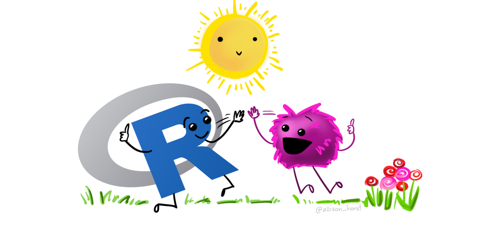

```{r setup, include=FALSE}
# packages
library(learnr)
library(tidyverse)
# hide non-exercise code chunks
knitr::opts_chunk$set(echo = FALSE)
```

## Welcome

This is DiscovRStat, the R laboratory materials for the course STAT2100: Discovering Statistics using R. The course is offered by the department of Statistics at <a href="https://www.squ.edu.om" target="_blank">Sultan Qaboos university</a>. R is a popular choice in data analytics for statistical computing and graphics that is widely used in sciences and social sciences. DiscovRStat introduces the R software environment, descriptive statistics, graphical exploration of data and basic inferential statistic such as analysis of relationships among variables using correlation and regression basic concepts.

If this is the first time you hear about R, the following short video created by R Consortium provides an overview about the program, its applications and what is used for.

<center>

<iframe width="560" height="315" src="https://www.youtube.com/embed/XcBLEVknqvY" title="YouTube video player" frameborder="0" allow="accelerometer; autoplay; clipboard-write; encrypted-media; gyroscope; picture-in-picture" allowfullscreen>

</iframe>

</center>

## Install RStudio

In RStat2101, you are going to work with a user-friendly R interface called RStudio. It is an integrated development environment (IDE) for working with R. It is easy for writing scripts and has practical features for data analysis and visualizations. Check out Rstudio website to take a tour of <a href="https://www.rstudio.com/products/RStudio/" target="_blank">RStudio's IDE</a>.

To install RStudio Desktop version on your personal computer, you need to install R first and then Rstudio.

-   To download and install R, click <a href="https://cran.r-project.org/" target="_blank">here</a>
-   To download and install RStudio, click <a href="https://www.rstudio.com/products/rstudio/download/" target="_blank">here</a>

{style="float: right; width: 200px; height: 200px;  "} For help installing R and RStudio, follow the installation instructions for <a href="https://rpubs.com/ImanAlhasani/RInstallationforWindows" target="_blank">Windows</a> users and <a href="https://rpubs.com/ImanAlhasani/RInstallationforMac" target="_blank">Mac</a> users (courtesy of Afra Al Manei, Department of Statistics, SQU). You can also sign up in <a href="https://rstudio.cloud/" target="_blank">RStudio Cloud</a> and use the online version of the program. Also, RStudio is available in Anaconda Navigator. However, R packages are not included in the default base environment and hence an R environment has to be created to run Rstudio. For help, see this <a href="https://docs.anaconda.com/anaconda/navigator/tutorials/create-r-environment/" target="_blank">Anaconda Documentation</a>.

## Discover R: Basics

#### Get Started

To use RStudio, you type code in it and ask the device to interpret them and act on their instructions. For some of you, this could be the first time you are coding, but do not worry! The course does not require to have any background in computer programming! Here, we will walk you through each of the steps required to begin using Rstudio.

Let us start your first R code! The following box is an empty code chunk provided to write and run code. For example, write `print("Welcome to R!")` and then click `Run Code`. The output will be shown below the chunk.

```{r welcome, exercise=TRUE}
```

Congrats, you've run your first line of code!{style="float: right;    " width="137" height="67"}

#### Create a Project

Rstudio project helps data analysts to group and organize all files required to conduct a project. This includes data files, analysis scripts, graphs and the analysis reports. The project is associated with R working directories. In this course, we focus on creating a project in a brand new directory. To create a project in R:

1.  click `File` - `New project..`, and then create project from `New Directory`.
2.  choose `New Project`
3.  name your project in `Directory name`.
4.  click `Browse…` to create a path to working directory and keep your project in.
5.  click `Create Project`.

This will open a new RStudio session with title of your project name. In the file pane, the path of the selected working directory will appear and the created project is shown with an `.Rproj` extension.

##### Exercise:

> Create a project with a name DiscovRStat and make it a sub-directory of a folder named S2100 on your desktop. [Hint: Follow the steps listed above.]

#### Create R Scripts

R code can be written and executed on the Console Pane. However, when a one is working on a project, the code gets long quickly with different instructions. Thus, it is more convenient to script code by creating an R script. To create an `R Script`, click `File` -- `New File` -- `R Script`. To save the R script, click `File` - `Save`, or click the `Save icon` at the top of the Script Editor panel. Make sure to save it in your working directory to organize your project files. This will show a file in the file pane with an `.R` extension.

##### Exercise:

> In your DiscovRStat project, create an R Script and save it with a name session1. Type the following on session1.R and run each line by clicking `Run`. Is there any difference in the outputs given by the four commands? - `"Welcome to my first R script"` - `'Welcome to my first R script'` - `print("Welcome to my first R script")` - `paste("Welcome to my first R script")`

```{r welcome-script, exercise=TRUE, exercise.eval=TRUE}
#solution

```

```{r welcome-script-hint }

"Welcome to my first R script" 

'Welcome to my first R script' 

print("Welcome to my first R script") 

paste("Welcome to my first R script")

```

#### Create Objects
